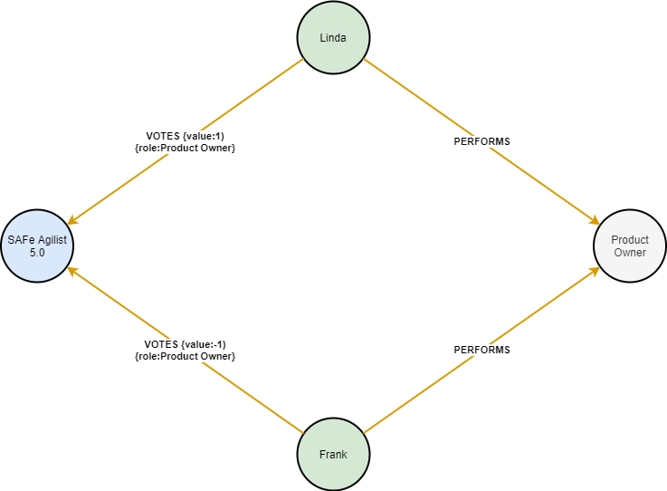

# DFP Courses

## Scenario 1 : Defined Courses for roles

Organisations have a well maintained list of recommended courses for a given role

 

:memo: in some cases the course catalogue may be imported from a separate data source and it's only the role and relationship information which is part of the import.

## Scenario 2 : People in a given role recommend courses

No centralized managed list of courses for a given role, recommendations are crowdsourced from those in the role today

 

 

_example_

 

### Limitations

- Requires at least one person in the role to make recommendations

### Sample Scripts

- :memo: [Setup and Sample Scripts](S2Script.cql)

### Possible extensions

- Include Region\Location within the returned result set 
- Include job level\experience factors within the returned result set
- Bridge across to other courses, base course recommendations not just the role... People who recommended this course also recommended these courses (Option include a filter based on roles)...

## Scenario 3 : People in a given role agree or disagree with recommend courses

This scenario can apply to both Scenario 1 and 2

 

 

_example_

 

### Sample Scripts

- :memo: [Setup and Sample Scripts](S3Script.cql)

---

Notes of graph model styles

 
